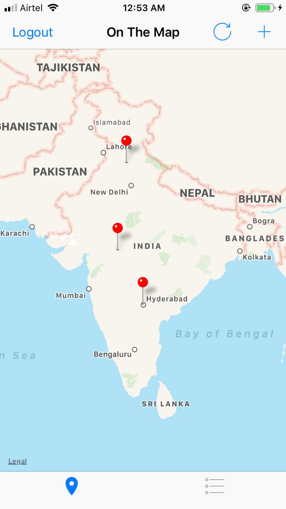
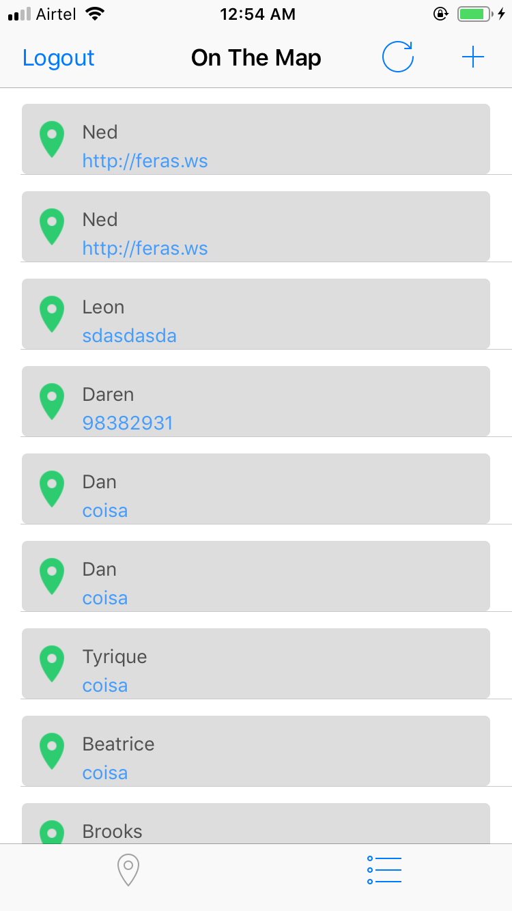
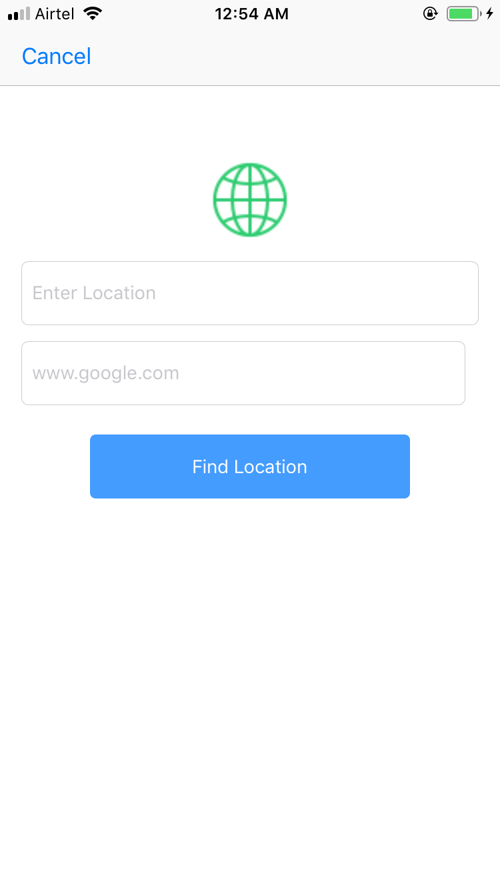
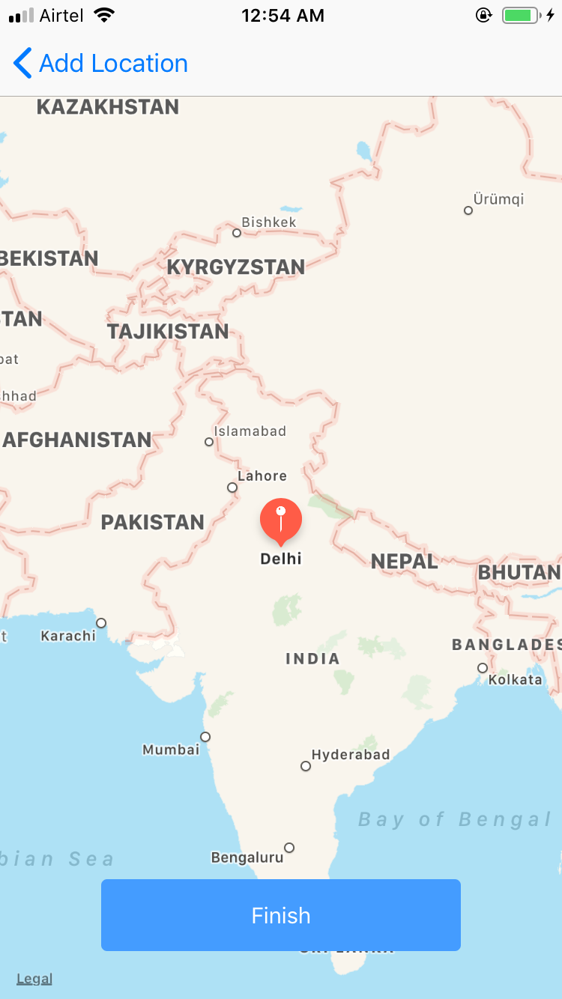

# Share your Location 
An iOS Application Fetches List of Pin locations posted by your friends on server .Pins contains additional information about the person who posted and their social media profile if they have added .Additionally user can also add his/her profile to board and post them to let others know .

This App uses
- Accessing networked data using Apple’s URL loading framework
- Authenticating a user using over a network connection
- Creating user interfaces that are responsive, and communicate network activity
- Use Core Location and the MapKit framework for to display annotated pins on a map

###### login page

###### Home page

###### Posted Locations ListView

###### Post Location 

###### Post Location DetailView

